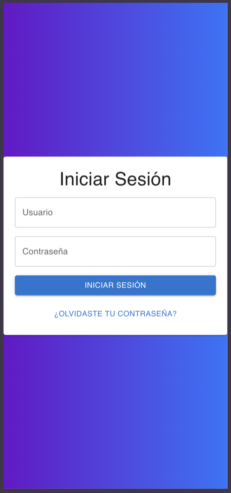

# Getting Started with Create React App

This project was bootstrapped with [Create React App](https://github.com/facebook/create-react-app).

## Requirements

- Node.js version `16.x` or higher is required.
- se instalará: Material UI, Axios, and React.

## Setup

1. Configure the `.env` file with the backend URL.
2. Install dependencies using npm:

### `npm install`

### `npm start`

Runs the app in the development mode.\
Open [http://localhost:3000](http://localhost:3000) to view it in your browser.

## Screenshots

